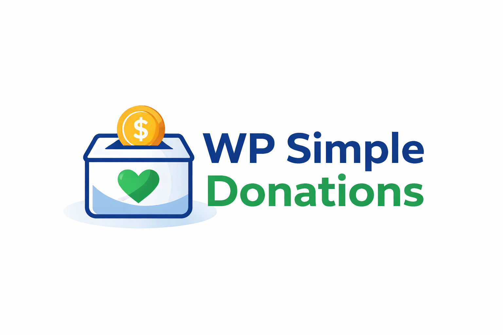

<p align="center">
  
</p>

<p align="center">
  <strong>Crowdfunding & donation plugin for WordPress</strong><br>
  Simple donations, recurring payments, goals, rewards, and multiple payment gateways.
</p>

<p align="center">
  
  
  
  
</p>

---

## Features

- **Simple Donations** — accept one-time or recurring donations with no end date
- **Advanced Crowdfunding** — authorize pledges and process after reaching a goal (Kickstarter-style)
- **Recurring Payments** — daily, weekly, monthly, or yearly
- **Reward Packages** — support levels with limited availability
- **Campaign Scheduling** — start & end dates with countdown
- **Progress Bar** — visual funding progress
- **Automated Emails** — thank you messages and confirmations
- **Modern CSS** — responsive, card-based design with CSS custom properties for easy theming
- **Shortcodes** — `[fundraiser_panel]`, `[pledges_panel]`, `[donate_button]`, `[progress_bar]`
- **5 Widgets** — fundraiser panel, simple donation, recent fundraisers, fundraisers list, pledges panel
- **Theme Templates** — full template hierarchy for single, checkout, and confirmation pages
- **User Access Control** — granular capabilities for team management
- **Multisite Support** — works with WordPress Multisite
- **Polish Translation** — complete pl_PL localization
- **Sample Data Seeder** — creates an example campaign on first activation

## Payment Gateways

| Gateway | Description |
|---------|-------------|
| **Przelewy24** | Polish payment gateway — REST API v1, sandbox & live modes |
| **PayU** | Polish payment gateway — REST API v2.1, OAuth2, webhook notifications |
| **PayPal** | REST API Orders v2 + JS SDK — popup checkout, no redirect |
| **Manual** | Offline/manual payment processing |

## Requirements

- WordPress 5.0+
- PHP 8.3+
- No build tools, Composer, or Node.js needed — plain PHP, jQuery, and CSS

## Installation

1. Download or clone this repository into `wp-content/plugins/wp-simple-donations/`
2. Activate the plugin via **Plugins** in the WordPress admin
3. Go to **Donations > Settings** and configure at least one payment gateway
4. Create your first campaign under **Donations > Add New**

On first activation the plugin creates a sample campaign with test pledges so you can see how everything looks right away.

## URL Structure

```
/fundraisers/                    — Archive (all campaigns)
/fundraisers/{slug}/             — Single campaign
/fundraisers/{slug}/pledge/      — Checkout page
/fundraisers/{slug}/thank-you/   — Confirmation page
```

The base slug (`fundraisers`) is configurable in plugin settings.

## Shortcodes

| Shortcode | Description |
|-----------|-------------|
| `[fundraiser_panel id="123"]` | Full campaign panel with stats, form, and progress bar |
| `[pledges_panel id="123"]` | List of recent or top pledges |
| `[donate_button title="Support us"]` | Simple PayPal donate button |
| `[progress_bar id="123"]` | Standalone progress bar |

## Template Overrides

Place templates in your theme directory to override defaults:

- `wdf_funder-{ID}.php` / `wdf_funder-{slug}.php` / `wdf_funder.php` — Single campaign
- `wdf_checkout-{ID}.php` / `wdf_checkout-{slug}.php` / `wdf_checkout.php` — Checkout
- `wdf_confirm-{ID}.php` / `wdf_confirm-{slug}.php` / `wdf_confirm.php` — Confirmation

Custom template functions can be loaded via the `WDF_CUSTOM_TEMPLATE_FUNCTIONS` constant.

## Custom Styles

The plugin ships with a modern default style (`wdf-default`) that adapts to your theme. To create a custom style:

1. Create a CSS file (e.g., `my-style.css`) in one of these locations:
   - `wp-content/wdf-styles/`
   - A directory defined by `WDF_EXTERNAL_STYLE_DIRECTORY` constant
2. The style will appear in the plugin settings dropdown

Override CSS custom properties to adjust colors without writing a full stylesheet:

```css
.wdf-default {
  --wdf-accent: #e11d48;      /* your brand color */
  --wdf-radius: 12px;         /* rounder corners */
  --wdf-success: #059669;     /* progress bar color */
}
```

## Origin & Modernization

This plugin is a fork of the archived [WPMU DEV Fundraising](https://github.com/nicholasgraziano/developer-developer) plugin (v2.6.4.9), modernized and maintained by [Karol Orzel / Devlom](https://devlom.com).

| Phase | Changes |
|-------|---------|
| **0** | Removed BuddyPress integration |
| **1** | PHP 8.3+ compatibility |
| **2** | Security hardening (nonces, sanitization, escaping) |
| **3** | Przelewy24 payment gateway |
| **4** | Rebranding to WP Simple Donations |
| **5** | Modern CSS system, Dotpay removal, payment flow validation |

## Contributing

Issues and pull requests are welcome. The codebase is plain PHP with no build step — edit and test directly in a WordPress installation.

## License

GPL-2.0-or-later
